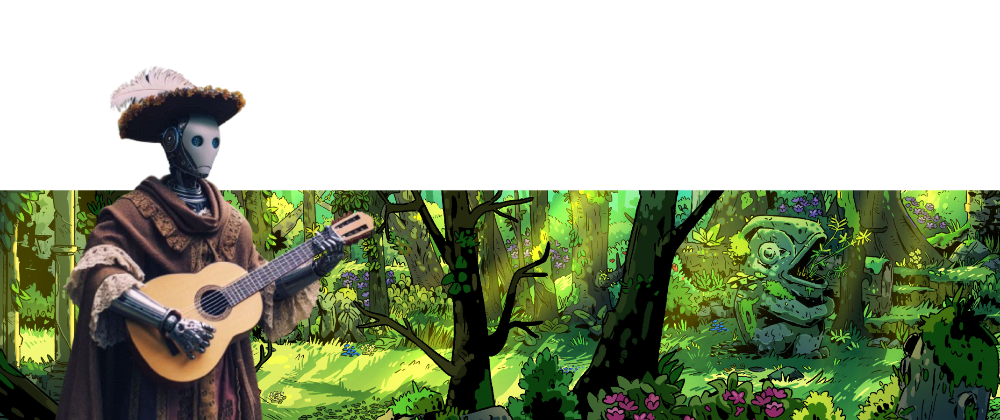

# 📜Podcast da história do React Native

Escute um aúdio e história criados por IA e revisada por humanos sobre como foi feito o react native.

## 💻 Tecnologias utilizadas no projeto

- [ChatGPT](https://chat.openai.com/)
- [Copilot](https://www.bing.com/chat)
- [Eleven Labs](https://elevenlabs.io)
- [Figma](https://www.figma.com)

## 🧠 Prompts

### Copilot
|   Ação   | Prompts  |
| :------: | ---------------------------------------- |
| Banner Android | Android de aparência humana com roupa de bardo |

### ChatGPT

|   Ação   | prompts                                  |
| :------: | ---------------------------------------- |
| História | me conte a história do react native como se fosse um conto de fadas e sem usar palavras em inglês se possível|